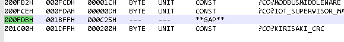

# MAG Laboratory IoT Supervisor
An IoT supervisor board\
https://maglaboratory.github.io/IoT-Supervisor/

## Acronyms, Abbreviations, and Definitions
| Term | Definition |
| ---- | ---------- |
| ADC | Analog to Digital Converter |
| BB | Busy Bee |
| CMP | Comparator |
| DBG | Debug |
| EFM | Energy Friendly Microcontroller |
| ID | Identification | 
| IoT | Internet of Trash |
| LDO | Low-DropOut Linear Regulator |
| LED | Light-Emitting Diode |
| MAG | Makers, Artists, and Gadgeteers |
| MMW | Modbus MiddleWare |
| PROG | Program Memory |
| PW | Password |
| SBC | Single-Board Computer | 
| SM | State Machine |
| SV | SuperVisor |
| UART | Universal Asynchronous Receiver / Transmitter |
| WDT | WatchDog Timer |
| XCVR | Transciever |

## Project Description
This is an IoT SBC supervisor for the MAG Laboratory IoT devices.

The following table describes the interfaces for this project:
| Interface | Description | Configurable |
| --------- | ----------- | ------------ |
| Reset | Pulls low if a reset condition is active | X | 
| Voltage Comparator | Initiates a reset if the voltage becomes too low | Resistor Divider |
| Modbus Watchdog | Initiates a reset if the watchdog is not pet for a period of time | Software Config. Period / Address / Baud |
| Heartbeat LED | Tells you this system is alive | Recompileable to a different period / intensity |

## Hardware Description
This description should change with the introduction of other branches where
hardware other than the EFM8BB1 with a bespoke SP485 adapter is used.

A general overview including pin descriptions is provided in this section.
A more detailed description should be provided in the hardware section.

### On-Chip Peripherals

The EFM8BB1 is clocked with the high-frequency internal oscillator divided by sixteen.
25.4 MHz / 16 is about 1.531 MHz.

A comparator is set with its negative input on P0.1 and positive input on the
internal 1.8V LDO.

Timer 0 high is set to overflow at 1.003 ms.
Timer 0 low is set to overflow at 1.254 ms and is not changed by the
initialization state machine.
Timer 1 is set and maintained by the initialization state machine its period 
should not be listed here.
Timer 2 is set to overflow 20 times per second.
This is probably faster than any application would reasonably poll for the 
voltage over modbus.
For reference, each modbus transaction takes something in the order of 7 ms
at full speed (38400 baud).
Timer 3 isn't used and is left disabled.

UART is enabled and is timed off of timer 1.

The ADC is enabled in burst mode and takes measurements at each timer 2 period.

The watchdog is enabled at 25ms.
It is serviced at the end of the timer 0 high interrupt.

Timer 0 low is used for T_1.5 in modbus to clear messages that have had too
much time in between their octets.

### Pins
The pin description here should exist to describe the pins in the "Debug" build
more than it describes the pins in the "Release" build.
The main purpose of this branch is to debug this build after all...

TODO: update this

| Pin | Name | Purpose |
| --- | ---- | ------- |
| P0.2 | RESET_LED | Reset LED Indication |
| P0.3 | XCVR_TXEN | Transciever Transmit Enable |
| P0.4 | UART_TX | UART Transmit | 
| P0.5 | UART_RX | UART Receive |
| P0.6 | PWR_LED | Power LED Indication.  Outputs the status of the SV. | 
| P0.7 | CMP1_A | Asynchronous Comparator Output. Immediately shows when the voltage in compartaor is triggered. |
| P1.0 | MODBUS_LED | Modbus LED Indication.  Blinks with modbus comms. |
| P1.1 | RESET_OUT | Reset Output.  Used to reset the SBC. Tie directly to SBC. |
| P1.2 | WDT_LED | Modbus WDT LED Indication.  On until the WDT is activated. |
| P1.3 | VIN_DIV | Voltage in after the divider. |

### Voltage Divider Detail
The voltage divider is set to 3.6v by default.  This is \f$1.8v * 2\f$.
The equation to find the set point is the multiplicative inverse of the
resistor divider equation multiplied by 1.8v.  Selection of the resistors
should begin at 100k ohms.  The default uses two 100kohm resistors.

\f{eqnarray*}{
    V_{min} = \frac{1.8v \cdot (R_1 + R_2)}{R_2}
\f}

## Modbus Register Description
This section contains tables describing the modbus registers.
Note that the holding registers are stored under function code `03` and the
input registers are under function code `04`.

| Address | Holding Register Read | Holding Register Write |
| :-: | --- | --- |
| 0 | Supervisor Status #sv_dev_sta_t | Modbus WDT Control |
| 1 | Configuration State Machine State #CfgSM_t | Password or Command |
| 2 | Modbus Control Bitfield | Modbus Control Bitfield |
| 3 | Watchdog Timeout (in seconds) | Watchdog Timeout (in seconds) |
| 4 | Next Password | Next Password | 

The following table lists the input registers which are read only by design.

| Address | Input Register Read |
| :-: | --- |
| 0 | ADC Bitfield |

### The ADC bitfield
The ADC bitfield includes the number of conversions in the upper 6 bits of
the bitfield because there is the slight possibility of the supervisor's
conversions freezing.

The following table documents the ADC bitfield:

| 15 | 14 | 13 | 12 | 11 | 10 | 9 | 8 | 7 | 6 | 5 | 4 | 3 | 2 | 1 | 0 |
| -- | -- | -- | -- | -- | -- | - | - | - | - | - | - | - | - | - | - |
| Number of Conversion |||||| Conversion Value in Counts ||||||||||

TODO provide sample code

### Supervisor Status
This section is for those who do not wish to read the other doxygen
documentation.  (Okay, maybe this section documents it better too...)

| 15 | 14 | 13 | 12 | 11 | 10 | 9 | 8 | 7 | 6 | 5 | 4 | 3 | 2 | 1 | 0 |
| -- | -- | -- | -- | -- | -- | - | - | - | - | - | - | - | - | - | - |
| Reserved |||||||| verifSt || lstRstS || wdtSmS || vinSmS ||

The `vinSmS` field contains three enumerations defined in #VinSm_t.
The eVIN_Init (0) state is the initial state which resets the SBC.
The eVIN_VLow (1) state of the SM is reached when the voltage is low.
The eVIN_OK (2) state of the SM is reached when everything is okay.
This field should read `2` under normal operation.

The `wdtSmS` field contains three enumerations defined in #mbWDTsmS_t.
The eMW_Ini (0) state is the intial state which disables or resets the 
state machine.
The eMW_En (1) state enables the state machine countdown.
The eMW_Timeout (2) state resets the SBC through the Vin and Reset state
machine.

The `lstRstS` field contains three enumerations defined in #LastRst_t.
The eLR_Init (0) state is the initial state which resets the SBC.
The eLR_VSM (1) state indicates that a low voltage condition caused the last
reset.
The eLR_WDT (1) state indicates that a modbus watchdog reset caused the last
reset.

The `verifSt` field contains four enumerations defined in #VerifSt_t.
The VS_Norm (0) state shows normal verification status.
The eVS_Cfg (1) state shows an abnormal configuration.
The eVS_Prog (2) state shows that the program memory CRC has a mismatch.
The eVS_Setup (3) state shows that the configuration header has a mismatch.
Upgrading from a previous version of the software could show the eVS_Setup
condition.  Unfortunately, the settings from previous versions are not imported
to newer versions of the software.

Writing '0' into this register resets the last reset source `lstRstS`.
Doing so also makes the heartbeat LED stop blinking menacingly after reset.

### Modbus WDT Control
The modbus watchdog timer is controlled using only two simple values.
The value #C_WDT_PET (0x5A) enables or pets the watchdog.
The value #C_WDT_DIS (0xA5) disables the watchdog.

These values may change, their doxygen values are provided for a hard reference

### Passwords and Commands
The password can not be set to a command value.
These are magic numbers defined as #C_CMD_COMMIT (0x5FAF) 
and #C_CMD_CANCEL (0x0000).
The password is set to #C_PW_DEFAULT (0xDEFA) by default.

These values may change, their doxygen values are provided for a hard reference

### Modbus Control Bitfield 
The modbus control bitfield contains fields for the baud and the servant id.
These collectively could be called B,S.
Both bitfields are byte aligned for your convenience.
This bitfield defaults to `511` which decodes as `0x1FF` meaning the SID is
set to `0xFF` and the BAUD to `1`.

The following table describes the positions of these bitfields:
| 15 | 14 | 13 | 12 | 11 | 10 | 9 | 8 | 7 | 6 | 5 | 4 | 3 | 2 | 1 | 0 |
| -- | -- | -- | -- | -- | -- | - | - | - | - | - | - | - | - | - | - |
| BAUD Enumeration |||||||| Servant ID ||||||||

The baud enum bitfield must be set to a number greater than #eMMW_B_NULL
and less than #eMMW_B_NUM.  Writing `0` to this bitfield does not change its
value and allows the other bitfield `Servant ID` to be changed.

The servant ID bitfield must be set to a number greater than or equal
to #C_SID_MIN (1) and less than or equal to #C_SID_MAX (247).  Like the other
bitfield at this address, writing `0` to this bitfield does not change its
value and allows the other bitfield `BAUD Enumeration` to be changed.
The servant ID is set to `255` by default.

## Branch Description
This branch is for porting the inital development performed on the EFM8BB1LCK
with the added SP485 breakout onto the newly designed PCB with blinky LEDs.

## Deployment
Is this section supposed to be about how this project was developed or how to
start developing for it?

The project started in 2019 after a lot of SBC's were found hung and needing
manual intervention.  Hopefully, after two years of development, this project
can automatically reset boards.

Development and builds can be done with the Keil C51 toolchain and Silicon Labs
Simplicity Studio v5.
Unfortunately, SDCC support and other (let me know which, pls) compilers that
may support the 8051 instruction set are not supported at the moment.

### Quickstart
This quickstart guide is written for this "zero" development branch in
particular which is completed on a prototype version of IoT SV hardware 
consisting of the EFM8BB1LCK board and a protoboard and enameled wire attached 
SOIC-8 SP485 transciever.

```
import minimalmodbus

instr = minimalmodbus.Instrument("/dev/ttyUSB0", 255)
instr.address = 255
instr.serial.baudrate = 38400
instr.serial.timeout = 0.5

# check communication
instr.read_registers(0x00, 2)

# enter cache mode
instr.write_register(0x01, 0xDEFA)

# configure the board for address 1
instr.write_register(0x02, 257)

# commit the configuration
instr.write_register(0x01, 0x5FAF)

# change the address
instr.address = 1

# check communication
instr.read_registers(0x00, 2)

# write to Flash
instr.write_register(0x01, 0xDEFA)

# check communication one last time
instr.read_registers(0x00, 2)
```

1. Select a resistor dividder value using the equation listed above.
2. Connect the hardware and the board.
3. Program the firmware onto the board
4. Run through the configuration once with the python above.  Note that the
address can be changed to one that the user desires.
Other settings can also be changed such as the baud and WDT timeout.
5. Come up with a daemon that can enable the watchdog and pet it constantly.
6. Enjoy your supervising solution.

### Building
Building the project while utilizing the built-in program memory CRC requires
some manual intervention and two cycles of clicking the "build" button.
It is possible to build and use the supervisor without using the program memory
CRC.
The only caveat to this is that the supervisor will always report a program CRC
error.

When creating a build, please look in the `.m51` file for information regarding
the end of code memory.
The constant `C_FOUND_PROG_END` in the file `IoT Supervisor.c`
should be manually changed based on the information in the `.m51` file:
* Look for a section called `C O D E   M E M O R Y`.
* Under that section, look for a `**GAP**` before `?CO?KIRISAKI_CRC`.
* Copy the `START` address of the `**GAP**` to be the constant called
`C_FOUND_PROG_END` in `IoT Supervisor.c`.



## Help
Please feel free to leave a bug report or start development on your own branch.

Other forms of communication outside of github are acceptable.

## Version History
 * Initial Commit
   * Low Voltage Comparator
   * Startup delay
   * Modbus, I guess
 * v0.0
   * It now supports configuration memory in FLASH.

## License
GNU GPL v3

## Authors
Brandon Kirisaki
